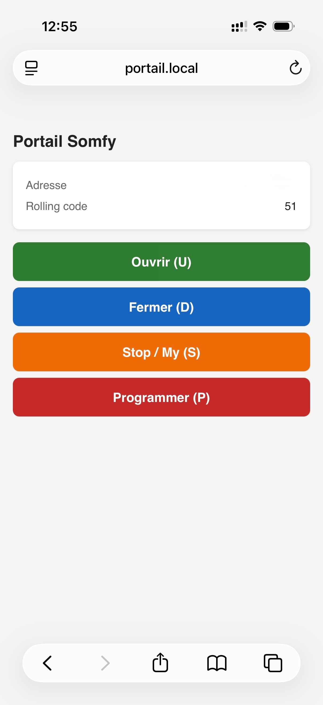

# esp32-Somfy-RTS




Dépôt : https://github.com/cyph-zz/esp32-Somfy-RTS-Alexa

Pilotage d'un portail/volet Somfy RTS (433,42 MHz) depuis un ESP32 WROVER-B équipé d'un module CC1101, avec configuration WiFi sans fil (WiFiManager), interface web d'administration et intégration Amazon Alexa (fauxmoESP).

Le firmware se comporte comme une télécommande Somfy RTS virtuelle : il génère et envoie les trames radio (rolling code inclus) directement depuis l'ESP32, sans passer par une télécommande physique.

## Fonctionnalités

- Émission de trames Somfy RTS (Ouvrir / Fermer / Stop-My / Prog) via CC1101 en 433,42 MHz
- Rolling code persistant en NVS (survit aux redémarrages et aux mises à jour de firmware)
- Configuration WiFi sans câble ni recompilation : portail captif (WiFiManager) au premier démarrage
- Interface web d'administration (adresse de la télécommande, rolling code courant, boutons de commande)
- Intégration Alexa locale (fauxmoESP, émulation d'un interrupteur WeMo) — aucun compte développeur ni cloud requis
- Découverte réseau via mDNS (`http://portail.local:8080`)

## Matériel nécessaire

- ESP32 WROVER-B (ou tout module ESP32 avec assez de broches libres)
- Module émetteur CC1101 433 MHz (avec connecteur SMA + antenne, ou fil de 17,3 cm en quart d'onde)
- Alimentation 3.3V stable pour le CC1101 (idéalement avec découplage 10µF + 100nF)

## Câblage

| CC1101 | ESP32 GPIO | Rôle |
|---|---|---|
| VCC | 3.3V (**pas 5V**) | Alimentation |
| GND | GND | Masse |
| CSN | GPIO5 | Chip Select SPI |
| SCK | GPIO18 | Horloge SPI (VSPI) |
| MOSI | GPIO23 | Data SPI |
| MISO / GDO1 | GPIO19 | Data SPI |
| GDO0 | GPIO27 | Sortie numérique (modulation Tx bit-bang) |
| GDO2 | GPIO26 | Non utilisé par le firmware actuel |

Broches à éviter sur un WROVER-B : GPIO0, 2, 12, 15 (strapping boot), GPIO6-11 (flash/PSRAM interne), GPIO34-39 (entrée seule).

## Installation

Le projet utilise [PlatformIO](https://platformio.org/).

```bash
git clone <url-du-repo>
cd esp32-Somfy-RTS
pio run -t upload
pio device monitor
```

Les dépendances (`SmartRC-CC1101-Driver-Lib`, `WiFiManager`, `FauxmoESP`) sont installées automatiquement par PlatformIO au premier build.

## Premier démarrage

Au premier boot (ou si le WiFi enregistré n'est plus disponible), l'ESP32 ouvre un point d'accès :

- SSID : `ESP32-Portail-Setup`
- Mot de passe : `somfysetup`

Connecte-toi dessus, un portail captif s'ouvre pour choisir ton réseau WiFi. Les identifiants sont ensuite sauvegardés en NVS : au prochain démarrage, la connexion se fait automatiquement.

## Association avec le récepteur Somfy

Cette télécommande virtuelle a sa propre adresse (`REMOTE_ADDRESS` dans `src/main.cpp`), inconnue du moteur au départ — il faut l'associer une fois :

1. Mets le moteur en mode programmation avec une télécommande **déjà appairée** (appui long sur PROG jusqu'à ce que le portail fasse un petit mouvement), ou via le bouton PROG du moteur si aucune télécommande n'est encore associée.
2. Dans les 2 minutes, envoie la commande PROG (bouton "Programmer" sur l'interface web, ou touche `p` dans le moniteur série).
3. Le moteur bouge légèrement = association réussie.

## Interface web

Une fois connecté au WiFi : `http://portail.local:8080` (ou l'IP affichée dans le moniteur série).

Affiche l'adresse de la télécommande et le rolling code courant, avec les commandes Ouvrir, Fermer, Stop/My et Programmer.

## Intégration Alexa

Le firmware expose un appareil virtuel nommé `portail`, détectable par les enceintes Echo sur le même réseau local (protocole d'émulation WeMo, port 80).

1. Flashe le firmware et vérifie que l'ESP32 est bien connecté au WiFi.
2. Dans l'appli Alexa : **Appareils → + → Ajouter un appareil → Autre → Découvrir les appareils** (ou "Alexa, découvre les appareils").
3. Commandes vocales : *"Alexa, allume portail"* (ouvre) / *"Alexa, éteins portail"* (ferme).

**Important** : l'Echo et l'ESP32 doivent être sur le même réseau/bande WiFi. Certaines box séparent le 2,4 GHz et le 5 GHz sur des SSID ou VLAN différents, ce qui bloque la découverte SSDP/UPnP.

## Configuration

Constantes à adapter dans `src/main.cpp` :

| Constante | Rôle |
|---|---|
| `PIN_GDO0` | GPIO relié au GDO0 du CC1101 |
| `REMOTE_ADDRESS` | Adresse 24 bits de la télécommande virtuelle (doit être unique si tu ajoutes d'autres télécommandes) |
| `AP_NAME` / `AP_PASSWORD` | Nom/mot de passe du point d'accès de configuration WiFi |
| `MDNS_HOSTNAME` | Nom d'hôte mDNS (`http://<nom>.local`) |

## Structure du projet

```
include/
  SomfyRemote.h     interface du protocole Somfy RTS
  WebAdmin.h        interface du serveur web d'administration
  AlexaBridge.h      interface du pont Alexa (fauxmoESP)
src/
  SomfyRemote.cpp   construction des trames, rolling code (NVS), envoi radio via GDO0
  WebAdmin.cpp      page d'administration (port 8080)
  AlexaBridge.cpp   appareil virtuel WeMo pour Alexa (port 80)
  main.cpp          WiFiManager, initialisation CC1101, point d'entrée
platformio.ini
```

## Dépannage

- **`CC1101 introuvable`** au boot : vérifie le câblage, en particulier VCC en 3.3V (le module ne tolère pas le 5V) et l'antenne.
- **Alexa ne détecte pas l'appareil** : active temporairement les logs de debug fauxmoESP en décommentant les `build_flags` dans `platformio.ini`, puis regarde si des requêtes M-SEARCH arrivent bien dans le moniteur série pendant une découverte. Si rien n'arrive, le problème est réseau (VLAN IoT, bande WiFi séparée, isolation AP) plutôt que logiciel.
- **Le portail ne réagit plus après plusieurs essais côté firmware puis fonctionne à nouveau avec la télécommande physique** : le rolling code du firmware a désynchronisé du récepteur (par exemple après un reflash sans conserver les données NVS) — refais l'association PROG.

## Avertissement

Ce projet pilote un système de contrôle d'accès physique (portail/volet). Ne l'utilise que sur du matériel dont tu es propriétaire ou explicitement autorisé à contrôler. L'auteur ne saurait être tenu responsable d'une mauvaise utilisation.

## Licence

MIT — voir [LICENSE](LICENSE).
